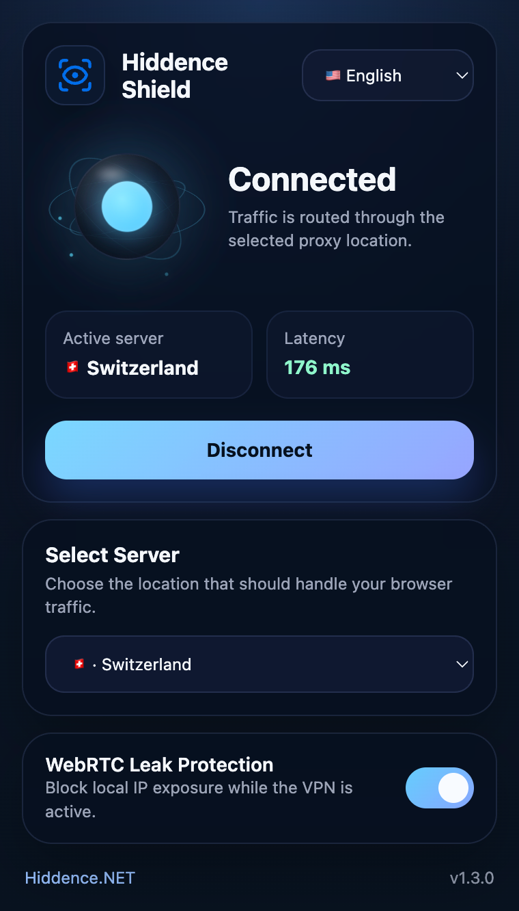

# Hiddence Shield

**Hiddence Shield** is a shared **Chrome** and **Firefox** extension codebase built with **React**. It provides browser-based proxy connection management with a modern popup UI, latency checks, connection-loss handling, WebRTC protection, notifications, and multi-language support.



## Features

- One-click proxy connect and disconnect
- Shared UI and logic for Chrome and Firefox
- Browser-specific background and manifest targets
- Multi-server support
- Latency measurement using a remote probe endpoint
- WebRTC leak protection
- Disconnect detection with badge and notification updates
- Localized interface

## Project Structure

```text
archive/
  src/
    App.js
    index.js
    popup.html
    styles.css
    assets/
    config/
      servers.js
    background/
      common.js
      chrome.js
      firefox.js
    lib/
      browserApi.js
      constants.js
      network.js
    i18n/
      translations.js
  targets/
    chrome/manifest.json
    firefox/manifest.json
  _locales/
  rules.json
  webpack.config.js
  package.json
```

## Build

Install dependencies:

```bash
npm install
```

Build both targets:

```bash
npm run build
```

Build only one browser:

```bash
npm run build:chrome
npm run build:firefox
```

The compiled builds are written to:

- `dist/chrome`
- `dist/firefox`

## Loading the Extension

### Chrome

1. Open `chrome://extensions/`
2. Enable Developer mode
3. Click `Load unpacked`
4. Select `dist/chrome`

### Firefox

1. Open `about:debugging#/runtime/this-firefox`
2. Click `Load Temporary Add-on`
3. Select `dist/firefox/manifest.json`

## Configuration

### Change proxy servers

Edit `src/config/servers.js`.

This file contains the available server list used by the popup and background logic.

Current example format:

```javascript
export const SERVER_LIST = [
  {
    id: 'uae',
    host: 'uae-example.proxy-example.com',
    port: 8080,
    scheme: 'http',
    country: 'United Arab Emirates',
    flag: '🇦🇪',
  },
  {
    id: 'us',
    host: 'us-example.proxy-example.com',
    port: 8080,
    scheme: 'http',
    country: 'United States',
    flag: '🇺🇸',
  }
];
```

To add or change proxy locations, update:

- `host`
- `port`
- `scheme`
- `country`
- `flag`
- `id`

### Change proxy credentials

Edit `src/background/common.js`.

Proxy authentication values are defined here:

```javascript
export const PROXY_USERNAME = 'PROXY_USERNAME';
export const PROXY_PASSWORD = 'PROXY_PASSWORD';
```

Replace these placeholders with your actual proxy credentials.

This file also contains shared background settings such as:

- keep-alive alarm name
- keep-alive interval
- ping measurement logic
- shared runtime state helpers

### Change keep-alive and ping settings

Also in `src/background/common.js`:

```javascript
export const KEEP_ALIVE_INTERVAL_MINUTES = 0.5;
```

And in `src/lib/constants.js`:

```javascript
export const PING_POLL_MS = 4000;
export const PING_TIMEOUT_MS = 5000;
```

These values control:

- background health-check interval
- popup ping refresh timing
- timeout for probe requests

### Change browser-specific behavior

Browser-specific background logic is separated into:

- `src/background/chrome.js`
- `src/background/firefox.js`

These files handle:

- applying proxy settings
- clearing proxy settings
- proxy authentication flow
- badge state updates
- disconnect notifications
- browser-specific privacy integration

### Change permissions or manifest settings

Edit:

- `targets/chrome/manifest.json`
- `targets/firefox/manifest.json`

These files control:

- permissions
- host permissions
- extension action settings
- background entry points
- browser-specific metadata

### Change UI

Edit:

- `src/App.js`
- `src/styles.css`
- `src/popup.html`
- `src/index.js`

### Change translations

Translations are stored in:

- `src/i18n/translations.js`
- `_locales/*/messages.json`

If you add a new user-facing string, keep translations in sync across both shared UI translations and locale metadata where needed.

### Change assets

Shared assets are stored in `src/assets`.

Webpack copies assets, locale files, manifest files, and `rules.json` into the browser-specific `dist` output.

## How connection monitoring works

The extension checks proxy health in the background while connected.

It uses:

- a probe request to `https://www.cloudflare.com/cdn-cgi/trace` for latency and availability checks
- alarms for periodic background checks
- badge updates to reflect connected or problem states
- notifications to warn users when the proxy connection is lost unexpectedly

## Supported Languages

The extension includes support for:

- English
- Russian
- Spanish
- German
- Ukrainian
- Portuguese
- Italian
- French
- Dutch
- Swedish
- Arabic
- Japanese
- Chinese
- Vietnamese
- Turkish
- Greek
- Polish
- Korean
- Hebrew
- Czech
- Lithuanian
- Latvian
- Estonian

## Notes

- This project uses placeholder proxy hosts and placeholder credentials by default.
- Before using it in production, replace the example values in `src/config/servers.js` and `src/background/common.js`.
- After changing proxy or manifest behavior, test both Chrome and Firefox builds.

## License

This project is licensed under the MIT License. See `LICENSE` for details.