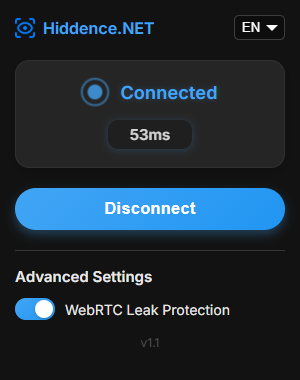

# Hiddence Shield

**Hiddence Shield** is an open-source Chrome extension that allows users to connect to a proxy server directly from their browser. It provides a simple and intuitive interface to toggle the VPN connection, enhancing privacy and accessibility while browsing the web.



This project is built with **React**.

## Features

- **One-Click Connect**: Easily connect and disconnect from the proxy server with a single click.
- **Connection Status**: View the current connection status and latency (ping).
- **WebRTC Leak Protection**: Includes an option to disable WebRTC to prevent IP address leaks.
- **Multi-language Support**: The interface is available in multiple languages.

## Installation and Building from Source

To run this extension, you'll need to build it from the source.

1.  Clone the repository:
    ```bash
    git clone https://github.com/Hiddence/Hiddence-Shield-Extension.git
    ```
2.  Navigate to the project directory:
    ```bash
    cd Hiddence-Shield
    ```
3.  Install the dependencies:
    ```bash
    npm install
    ```
4.  Build the project:
    ```bash
    npm run build
    ```
5.  The compiled extension will be in the `dist/` directory.
6.  Open Chrome and navigate to `chrome://extensions/`.
7.  Enable "Developer mode" in the top right corner.
8.  Click "Load unpacked" and select the `dist/` directory from this project.

## Configuration

Before using the extension, you need to configure it to work with your proxy server.

### Proxy Settings

Open the `js/background.js` file and locate the proxy configuration section:

```javascript
const PROXY_HOST = 'proxy.example.com';
const PROXY_PORT = 1080;
const PROXY_SCHEME = 'socks5';
```

Replace the proxy configuration with your own settings.

## Language Support

The extension supports the following languages. The interface will automatically try to match your browser's language, or you can select one manually.

-   🇺🇸 English (en)
-   🇷🇺 Russian (ru)
-   🇪🇸 Spanish (es)
-   🇩🇪 German (de)
-   🇺🇦 Ukrainian (uk)
-   🇵🇹 Portuguese (pt)
-   🇮🇹 Italian (it)
-   🇫🇷 French (fr)
-   🇳🇱 Dutch (nl)
-   🇸🇪 Swedish (sv)
-   🇸🇦 Arabic (ar)
-   🇯🇵 Japanese (ja)
-   🇨🇳 Chinese (zh)
-   🇻🇳 Vietnamese (vi)
-   🇹🇷 Turkish (tr)
-   🇬🇷 Greek (el)
-   🇵🇱 Polish (pl)
-   🇰🇷 Korean (ko)
-   🇮🇱 Hebrew (he)
-   🇨🇿 Czech (cs)
-   🇱🇹 Lithuanian (lt)
-   🇱🇻 Latvian (lv)
-   🇪🇪 Estonian (et)

Translations are managed within the React component at `src/App.js`.

## Security Considerations

- **Hardcoded Credentials**: Avoid hardcoding sensitive information like usernames and passwords directly into the code.
- **Secure Proxy Certificate**: If your proxy server uses a self-signed SSL certificate, you may encounter certificate errors. It is recommended to use a certificate from a trusted Certificate Authority (CA).

## License

This project is licensed under the MIT License - see the [LICENSE](LICENSE) file for details.